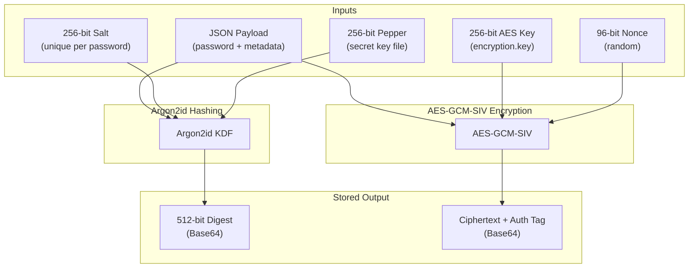

# 🔐 Secure Password Generator

[](https://www.redhat.com/en/technologies/linux-platforms/enterprise-linux) <!-- https://www.redhat.com/en/about/brand/standards/color -->
[](https://fedoraproject.org/) <!-- https://docs.fedoraproject.org/en-US/project/brand/#_colors -->
 <!-- https://brandpalettes.com/python-logo-colors -->
 <!-- https://brand.mit.edu/color -->


A robust, powerful, and secure command-line utility for generating **cryptographically strong passwords**. Built with Python's `secrets` module, this tool supports Argon2id password hashing and Base64-encoded AES-GCM-SIV encryption with customizable character sets, password metadata organization, and advanced search capabilities.

<br/>

<p align="center">

</p>

---

## ✨ Features

- **Cryptographically Secure** randomness via Python's `secrets` module
- **AES-GCM-SIV Encryption** with Base64-encoded storage for misuse-resistant authenticated encryption
- **Argon2id Hashing** with unique 256-bit salt per password and a separate 256-bit pepper key
- **Secure File Deletion** - files overwritten with random data multiple times before removal
- **Restrictive Permissions** - all files created with `0600` (owner read/write only)
- **Flexible Character Policies** - uppercase, lowercase, digits, symbols, blanks, custom symbol sets, exclude similar characters, prevent consecutive duplicates, minimum per-type requirements
- **Pattern-Based Generation** - define exact character type positions (`l`=lower, `u`=upper, `d`=digit, `s`=symbol, `b`=blank, `*`=any)
- **Password Strength Meter** - length-based scoring, character diversity bonuses, uniqueness penalties, pattern detection (1-10 scale)
- **Metadata & Organization** - labels, categories, comma-separated tags, automatic timestamps
- **History Management** - ASCII table view, search by label/category/tags, filter by strength/category/date, entry deletion
- **Config File Support** - load defaults from YAML or JSON config files; CLI args always override
- **Clipboard Support** - copy passwords via `pyperclip` or `xclip` (RHEL/Fedora Linux)
- **Performance Optimized** - clipboard method caching, encryption key caching, pre-validation of generation constraints

---

## 🚀 Getting Started

### 🔍 Prerequisites

- Python **3.13+**
- `cryptography` library (for encryption)
- `PyYAML` library (for YAML config file support)
- `pyperclip` or `xclip` (optional, for clipboard support on RHEL/Fedora Linux)

### 🛠️ Installation

1. Clone this repository to your local machine:

    ```bash
    git clone https://github.com/jayissi/Secure-Password-Generator.git
    ```

2. Install required dependencies:

    ```bash
    pip3 install -r requirements.txt
    ```

3. Make the script executable:

    ```bash
    chmod +x Secure-Password-Generator/password_generator.py
    ```

4. (Optional) Move it to your local bin folder:

    ```bash
    sudo mv Secure-Password-Generator/password_generator.py /usr/local/bin/password_generator
    ```

<br/>

That's it! You're ready to generate passwords.

---

## 💻 Usage

Run the script from your terminal using `password_generator` with your desired options.  
If you run the script with no arguments or with the `-h` flag, it will display the help menu.

```bash
password_generator -h
```

### ⚙️ Command-Line Arguments

#### Basic Options

| Argument               | Short | Description                                  | Default |
|:----------------------:|:-----:|----------------------------------------------|:-------:|
| `--length`             | `-L`  | Password length (min: 8)                     | 12      |
| `--count`              | `-c`  | Number of passwords to generate              | 1       |
| `--passphrase`         | `-P`  | Custom passphrase (supersedes other options) | None    |
| `--config`             | `-f`  | Load defaults from YAML/JSON config file     | None    |
| `--clipboard`          | `-X`  | Copy password to clipboard                   | False   |
| `--help`               | `-h`  | Show help message                            | N/A     |

#### Character Type Options

| Argument               | Short | Description                                  | Default |
|:----------------------:|:-----:|----------------------------------------------|:-------:|
| `--full`               | `-F`  | Use all character types + no-repeats         | False   |
| `--upper`              | `-u`  | Include uppercase letters                    | False   |
| `--lower`              | `-l`  | Include lowercase letters                    | False   |
| `--digits`             | `-d`  | Include digits                               | False   |
| `--symbols`            | `-s`  | Include symbols                              | False   |
| `--allowed-symbols`    | `-a`  | Custom allowed symbols (implies --symbols)   | None    |
| `--blank`              | `-b`  | Include space (never first/last)             | False   |
| `--pattern`            | `-p`  | Pattern: l=lower, u=upper, d=digit, s=symbol, b=blank, *=any | None |

#### Advanced Options

| Argument               | Short | Description                                  | Default |
|:----------------------:|:-----:|----------------------------------------------|:-------:|
| `--min`                | `-m`  | Min chars per selected type                  | 1       |
| `--no-repeats`         | `-r`  | No consecutive duplicate chars               | False   |
| `--exclude-similar`    | `-e`  | Exclude similar-looking chars                | False   |

#### Password Organization Options

| Argument               | Description                                  | Default |
|:----------------------:|----------------------------------------------|:-------:|
| `--label`              | Label/name for this password                 | "Unnamed" |
| `--category`           | Category for this password                   | "General" |
| `--tags`               | Comma-separated tags                         | []      |

#### History Search & Filter Options

| Argument               | Description                                  |
|:----------------------:|----------------------------------------------|
| `--search`             | Search history by label, category, or tags   |
| `--filter-strength`    | Show only passwords with strength >= value   |
| `--filter-category`    | Show only passwords in this category         |
| `--since`              | Show passwords created since date (YYYY-MM-DD) |
| `--delete-entry`       | Delete specific entry by index number        |
| `--limit`              | Limit number of history entries to display   |

#### File Operations

| Argument               | Short | Description                                  | Default |
|:----------------------:|:-----:|----------------------------------------------|:-------:|
| `--no-save`            | `-n`  | Don't save to password file                  | False   |
| `--show-history`       | `-H`  | Show password generation history             | False   |
| `--cleanup`            | `-C`  | Clean up password and key files              | False   |

---

## 📝 Examples

**1. Generate a strong password with all character types**

```bash
password_generator -F -L 16 --label "Gmail Account" --category "Email" --tags "work,important"
```

```
Generated Password 1: p@55W0rD Ex&mpl3
Strength: ████████░░ 8/10
[✓] Passwords securely saved to /home/user/.secure_passwords/vault.enc
```

<br/>

**2. Advanced requirements**  
Create (5x) 20-character passwords with at least 3 of each type, no similar characters, no consecutive duplicates, and a custom symbol set.

```bash
password_generator -c 5 -L 20 -u -l -d -m 3 -e -r -a '!@*#^ $&%\"' -n
```

<br/>

**3. Pattern-based generation**  
Define exact character type positions: `l`=lower, `u`=upper, `d`=digit, `s`=symbol, `b`=blank, `*`=any.

```bash
password_generator --pattern 'lluuddss' --label "Pattern Test" --category "Testing"
password_generator --pattern '****lluu' -n
```

<br/>

**4. Custom passphrase**  
Store a user-provided passphrase with metadata.

```bash
password_generator -P "MySecurePass123!" --label "Custom Pass" --category "Personal" --tags "manual"
```

<br/>

**5. View password history**

```bash
password_generator -H
```

```
┌─────┬───────────────┬──────────────────────┬──────────────┬────────────┬──────────────────────┐
│ #   │ Label         │ Password             │ Strength     │ Category   │ Created              │
├─────┼───────────────┼──────────────────────┼──────────────┼────────────┼──────────────────────┤
│ 1   │ Gmail Account │ C1l\|T3qZ7KfTqp8     │ 8/10         │ Email      │ 2025-11-15 08:56     │
│ 2   │ Bank Account  │ 16DB<dNrUb9{         │ 6/10         │ Banking    │ 2025-11-15 08:55     │
└─────┴───────────────┴──────────────────────┴──────────────┴────────────┴──────────────────────┘
```

<br/>

**6. Search and filter history**  
Search, filter by category/strength, and combine filters.

```bash
password_generator -H --search "Gmail"
password_generator -H --filter-category "Email" --filter-strength 7 --limit 5
password_generator --delete-entry 1
```

<br/>

**7. Config file usage**  
Load defaults from a YAML or JSON config file. CLI arguments always override config values.

```bash
password_generator -f config.yaml
password_generator -f config.json -L 32
```

<br/>

**8. Secure cleanup**  
Securely delete all password and key files.

```bash
password_generator -C
```

---

## 📁 Config File

Load default settings from a YAML or JSON config file using `-f`. All fields are optional - omitted fields fall back to CLI defaults. Format is auto-detected by file extension (`.yaml`/`.yml`/`.json`).

**Example `config.yaml`:**

```yaml
length: 24
upper: true
lower: true
digits: true
symbols: true
no_repeats: true
exclude_similar: false
min_chars: 2
allowed_symbols: "!@#$%^&*?`"
blank_space: false

# Optional metadata defaults
label: "My Default Label"
category: "General"
tags: "default,work"
```

**Equivalent `config.json`:**

```json
{
  "length": 24,
  "upper": true,
  "lower": true,
  "digits": true,
  "symbols": true,
  "no_repeats": true,
  "exclude_similar": false,
  "min_chars": 2,
  "allowed_symbols": "!@#$%^&*?`",
  "blank_space": false,
  "label": "My Default Label",
  "category": "General",
  "tags": "default,work"
}
```

**Config Field Reference:**

| Field              | Type   | Description                                  | Default     |
|:------------------:|:------:|----------------------------------------------|:-----------:|
| `length`           | int    | Password length (minimum: 8)                 | 12          |
| `upper`            | bool   | Include uppercase letters                    | false       |
| `lower`            | bool   | Include lowercase letters                    | false       |
| `digits`           | bool   | Include digits                               | false       |
| `symbols`          | bool   | Include symbols                              | false       |
| `no_repeats`       | bool   | Prevent consecutive duplicates               | false       |
| `exclude_similar`  | bool   | Exclude similar-looking characters           | false       |
| `min_chars`        | int    | Minimum characters per selected type         | 1           |
| `allowed_symbols`  | string | Custom symbol set                            | All punctuation |
| `blank_space`      | bool   | Include space character                      | false       |
| `label`            | string | Default label for passwords                  | "Unnamed"   |
| `category`         | string | Default category for passwords               | "General"   |
| `tags`             | string | Comma-separated default tags                 | None        |

---

## 🛡️ Security Details

This tool is designed with security as a top priority. `JSON Payload → Argon2id (Salt + Pepper) → Encrypt → Store`

### Storage Location

- **Password Vault**: `${HOME}/.secure_passwords/vault.enc`
- **Encryption Key**: `${HOME}/.secure_passwords/encryption.key` (256-bit AES key)
- **Pepper Key**: `${HOME}/.secure_passwords/pepper.key` (256-bit pepper for Argon2id)

### Security Features

- **Randomness**: Uses Python's `secrets` module, not `random`, ensuring cryptographic quality randomness.
- **Minimum Length**: Enforces a minimum of 8 characters, with recommended defaults of 12+.
- **AES-GCM-SIV Encryption**: Provides misuse-resistant authenticated encryption; records are Base64-encoded per line to prevent newline corruption.
- **Argon2id (Salt + Pepper) Hashing**: 
  - Each password uses a **unique 256-bit salt** per password
  - A **separate 256-bit pepper** key file provides additional protection
  - 512-bit digest output
  - Memory-hard algorithm resistant to GPU/ASIC attacks
- **Timestamp**: Each password entry is stamped with creation time.
- **File Permissions**: All files are created with `0600` file permissions (read/write) restricted to the file's owner.
- **Secure Deletion**: Files are overwritten with random data multiple times before deletion to prevent data recovery.

### 🔐 Argon2id (Salt + Pepper) + AES-GCM-SIV Encryption Flow


```mermaid
flowchart TD
    subgraph inputs [Inputs]
        payload["JSON Payload<br/>(password + metadata)"]
        salt["256-bit Salt<br/>(unique per password)"]
        pepper["256-bit Pepper<br/>(secret key file)"]
        aesKey["256-bit AES Key<br/>(encryption.key)"]
        nonce["96-bit Nonce<br/>(random)"]
    end

    subgraph hashing [Argon2id Hashing]
        argon2["Argon2id KDF"]
    end

    subgraph encryption [AES-GCM-SIV Encryption]
        aesgcm["AES-GCM-SIV"]
    end

    subgraph output [Stored Output]
        digest["512-bit Digest<br/>(Base64)"]
        ciphertext["Ciphertext + Auth Tag<br/>(Base64)"]
    end

    payload --> argon2
    salt --> argon2
    pepper --> argon2
    argon2 --> digest

    payload --> aesgcm
    aesKey --> aesgcm
    nonce --> aesgcm
    aesgcm --> ciphertext
```

<br/>

> [!CAUTION]
> You are responsible for the secure management of the `${HOME}/.secure_passwords/` directory and its contents.  
> Ensure it is stored and secured properly and ***do not share or back them up insecurely***.

---

## 🧪 Testing

The project includes a comprehensive integration test suite (41 tests). Run tests directly:

```bash
bash test_integration.sh
```

Or test in an isolated Podman container:

```bash
podman run --rm -v $(pwd):/workspace:Z fedora:latest bash -c "cd /workspace && dnf install -y python3 python3-pip > /dev/null 2>&1 && pip3 install cryptography pyperclip > /dev/null 2>&1 && bash test_integration.sh"
```

**Exit Codes:** On failure, the script exits with the test number that failed (e.g., exit code `15` means Test 15 failed). Exit code `0` indicates all tests passed.

---

## 🤝 Contributing

Contributions are welcome! Please open an issue or pull request for any improvements.

---

## 📜 License

This project is licensed under the MIT License. See the [LICENSE](LICENSE) file for more details.
