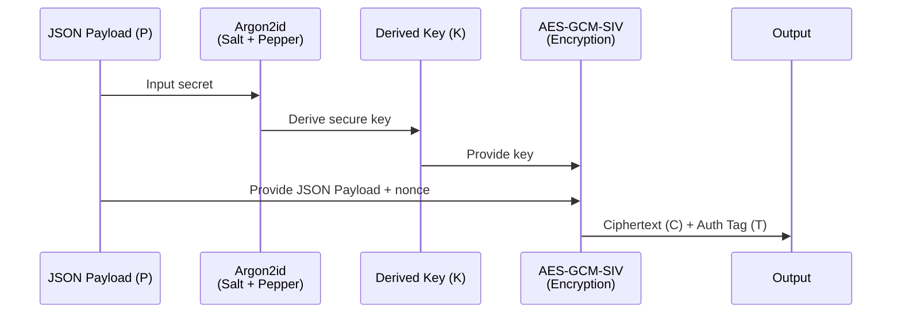

# 🔐 Secure Password Generator

[](https://www.redhat.com/en/technologies/linux-platforms/enterprise-linux) <!-- https://www.redhat.com/en/about/brand/standards/color -->
[](https://fedoraproject.org/) <!-- https://docs.fedoraproject.org/en-US/project/brand/#_colors -->
 <!-- https://brandpalettes.com/python-logo-colors -->
 <!-- https://brand.mit.edu/color -->


A robust, powerful, and secure command-line utility for generating **cryptographically strong passwords**. Built with Python's `secrets` module, this tool supports Argon2id password hashing and Base64-encoded AES-GCM-SIV encryption with customizable character sets, password metadata organization, and advanced search capabilities.

<br/>

<p align="center">

</p>

---

## ✨ Features

### 🔒 Security & Encryption

- **Cryptographically Secure**: Utilizes Python's `secrets` module, which is designed to generate unpredictable secure values suitable for cryptographic purposes.
- **AES-GCM-SIV Encryption**: Provides misuse-resistant authenticated encryption; records are Base64-encoded per line to prevent file corruption.
- **Argon2id (Salt + Pepper) Hashing**: Each password is hashed with Argon2id using a unique 256-bit salt per password. A separate 256-bit pepper key file provides additional protection against offline brute force attacks.
- **Secure File Deletion**: Files are securely overwritten with random data multiple times before deletion to prevent data recovery.
- **File Permissions**: All files are created with `0600` file permissions (read/write) restricted to the file's owner.

### 🎯 Password Generation

- **Flexible Password Policies**:
  - Minimum enforced length (8+ characters, configurable)
  - Uppercase letters (`A-Z`)
  - Lowercase letters (`a-z`)
  - Digits (`0-9`)
  - Symbols (customizable or default punctuation)
  - Blank/space character support (never placed as first or last character)
  - Minimum character requirements per character type
  - Prevent consecutive duplicate characters
  - Exclude similar-looking characters (`i`, `l`, `1`, `L`, `o`, `0`, `O`)
  - Pattern-based generation (define exact character type positions)

- **Password Strength Meter**: 
  - Length-based scoring (primary factor)
  - Character type diversity bonuses
  - Uniqueness ratio penalties
  - Pattern detection for weak passwords
  - Visual strength meter with numeric score (1-10)

### 📊 Password Metadata & Organization

- **Labels**: Assign descriptive names to passwords (e.g., "Gmail Account")
- **Categories**: Organize passwords by category (e.g., "Email", "Banking", "Social")
- **Tags**: Add multiple tags for flexible organization (e.g., "work,important,2fa")
- **Automatic Metadata**: Each password includes timestamp and strength score

### 🔍 History Management & Search

- **Table View**: Beautiful ASCII table format displaying password history with numeric strength scores
- **Search**: Search passwords by label, category, or tags
- **Filtering**: 
  - Filter by minimum strength score
  - Filter by category
  - Filter by creation date
  - Combine multiple filters
- **Limit Results**: Display only the most recent N entries
- **Entry Deletion**: Securely delete specific entries by index number

### ⚡ Performance Optimizations

- **Clipboard Caching**: Clipboard method is cached on first use (RHEL/Fedora Linux support via `pyperclip` or `xclip`)
- **Encryption Key Caching**: Encryption keys are cached with file modification time checking
- **Lazy Loading**: Efficient file I/O with optimized history reading
- **Pre-validation**: Password generation constraints are validated before attempting generation

### 🛠️ Advanced Options

- Generate multiple passwords at once
- Copy passwords to clipboard (RHEL/Fedora Linux)
- Custom passphrase mode (store user-provided passwords)
- Pattern-based generation for precise control
- Secure cleanup of all password and key files

---

## 🚀 Getting Started

### 🔍 Prerequisites

- Python **3.13+**
- `cryptography` library (for encryption)
- `pyperclip` or `xclip` (optional, for clipboard support on RHEL/Fedora Linux)

### 🛠️ Installation

1. Clone this repository to your local machine:

    ```bash
    git clone https://github.com/jayissi/Secure-Password-Generator.git
    ```

2. Install required dependencies:

    ```bash
    pip3 install -r requirements.txt
    ```

3. Make the script executable:

    ```bash
    chmod +x Secure-Password-Generator/password_generator.py
    ```

4. (Optional) Move it to your local bin folder:

    ```bash
    sudo mv Secure-Password-Generator/password_generator.py /usr/local/bin/password_generator
    ```

<br/>

That's it! You're ready to generate passwords.

---

## 💻 Usage

Run the script from your terminal using `password_generator` with your desired options.  
If you run the script with no arguments or with the `-h` flag, it will display the help menu.

```bash
password_generator -h
```

### ⚙️ Command-Line Arguments

#### Basic Options

| Argument               | Short | Description                                  | Default |
|:----------------------:|:-----:|----------------------------------------------|:-------:|
| `--length`             | `-L`  | Password length (min: 8)                     | 12      |
| `--count`              | `-c`  | Number of passwords to generate              | 1       |
| `--passphrase`         | `-P`  | Custom passphrase (supersedes other options) | None    |
| `--clipboard`          | `-X`  | Copy password to clipboard                   | False   |
| `--help`               | `-h`  | Show help message                            | N/A     |

#### Character Type Options

| Argument               | Short | Description                                  | Default |
|:----------------------:|:-----:|----------------------------------------------|:-------:|
| `--full`               | `-F`  | Use all character types + no-repeats         | False   |
| `--upper`              | `-u`  | Include uppercase letters                    | False   |
| `--lower`              | `-l`  | Include lowercase letters                    | False   |
| `--digits`             | `-d`  | Include digits                               | False   |
| `--symbols`            | `-s`  | Include symbols                              | False   |
| `--allowed-symbols`    | `-a`  | Custom allowed symbols (implies --symbols)   | None    |
| `--blank`              | `-b`  | Include space (never first/last)             | False   |
| `--pattern`            | `-p`  | Pattern: l=lower, u=upper, d=digit, s=symbol, b=blank, *=any | None |

#### Advanced Options

| Argument               | Short | Description                                  | Default |
|:----------------------:|:-----:|----------------------------------------------|:-------:|
| `--min`                | `-m`  | Min chars per selected type                  | 1       |
| `--no-repeats`         | `-r`  | No consecutive duplicate chars               | False   |
| `--exclude-similar`    | `-e`  | Exclude similar-looking chars                | False   |

#### Password Organization Options

| Argument               | Description                                  | Default |
|:----------------------:|----------------------------------------------|:-------:|
| `--label`              | Label/name for this password                 | "Unnamed" |
| `--category`           | Category for this password                   | "General" |
| `--tags`               | Comma-separated tags                         | []      |

#### History Search & Filter Options

| Argument               | Description                                  |
|:----------------------:|----------------------------------------------|
| `--search`             | Search history by label, category, or tags   |
| `--filter-strength`    | Show only passwords with strength >= value   |
| `--filter-category`    | Show only passwords in this category         |
| `--since`              | Show passwords created since date (YYYY-MM-DD) |
| `--delete-entry`       | Delete specific entry by index number        |
| `--limit`              | Limit number of history entries to display   |

#### File Operations

| Argument               | Short | Description                                  | Default |
|:----------------------:|:-----:|----------------------------------------------|:-------:|
| `--no-save`            | `-n`  | Don't save to password file                  | False   |
| `--show-history`       | `-H`  | Show password generation history             | False   |
| `--cleanup`            | `-C`  | Clean up password and key files              | False   |

---

## 📝 Examples

### Basic Password Generation

**1. Generate and save a password (16 chars, all types)**  
Create a 16-character password using all character types and save it with metadata.

```bash
password_generator -F -L 16 --label "Gmail Account" --category "Email" --tags "work,important"
```

**Output:**

```bash
Generated Password 1: p@55W0rD Ex&mpl3
Strength: ████████░░ 8/10
[✓] Passwords securely saved to /home/user/.secure_passwords/vault.enc
```

<br/>

**2. Generate a 26-character password (no repeats, do not save)**  
This creates a 26-character password with no repetitive characters.

```bash
password_generator -L 26 --upper --lower --digits --symbols --no-repeats --no-save
```

**Output:**

```bash
Generated Password 1: V3ry-L0ng&S3cur3!P@ssw0rd#
Strength: ████████░░ 8/10
```

<br/>

**3. Generate a password with strict requirements**  
Create a 16-character password with at least 2 of each selected character type.

```bash
password_generator -L 16 --upper --lower --digits --symbols --blank --no-repeats --min 2 --no-save
```

<br/>

**4. Use a custom symbol set**  
Create a password using only `@#$%` as symbols.

```bash
password_generator -n -u -l -a '@#$%'
```

<br/>

**5. Pattern-based generation**  
Generate a password following a specific pattern.

```bash
password_generator --pattern "lluuddss" --label "Pattern Test" --category "Testing"
```

Pattern codes:
- `l` = lowercase letter
- `u` = uppercase letter
- `d` = digit
- `s` = symbol
- `b` = blank (space)
- `*` = random character from all types

<br/>

**6. Advanced Requirements**  
Create (5x) 20-character passwords with:

- At least 3 of each character type
- No similar characters
- No consecutive duplicates
- Only use `!@*#^ $&%\"` as valid symbols
- Output to stdout only

```bash
password_generator -c 5 -L 20 -u -l -d -m 3 -e -r -a '!@*#^ $&%\"' -n
```

<br/>

**7. Custom Passphrase**  
Store a user-provided passphrase with metadata.

```bash
password_generator -P "MySecurePass123!" --label "Custom Pass" --category "Personal" --tags "manual"
```

**Output:**

```bash
[ Custom Passphrase Mode ]
Using provided passphrase: MySecurePass123!
✓ Passphrase securely saved to /home/user/.secure_passwords/vault.enc
```

<br/>

### History Management

**8. View password history (table format)**  
Display all saved passwords in a formatted table.

```bash
password_generator -H
```

**Output:**

```
┌─────┬───────────────┬──────────────────────┬──────────────┬────────────┬──────────────────────┐
│ #   │ Label         │ Password             │ Strength     │ Category   │ Created              │
├─────┼───────────────┼──────────────────────┼──────────────┼────────────┼──────────────────────┤
│ 1   │ Gmail Account │ C1l\|T3qZ7KfTqp8     │ 8/10         │ Email      │ 2025-11-15 08:56     │
│ 2   │ Bank Account  │ 16DB<dNrUb9{         │ 6/10         │ Banking    │ 2025-11-15 08:55     │
└─────┴───────────────┴──────────────────────┴──────────────┴────────────┴──────────────────────┘
```

<br/>

**9. Search history**  
Search for passwords by label, category, or tags.

```bash
password_generator -H --search "Gmail"
```

<br/>

**10. Filter by category**  
Show only passwords in a specific category.

```bash
password_generator -H --filter-category "Email"
```

<br/>

**11. Filter by strength**  
Show only strong passwords (strength >= 8).

```bash
password_generator -H --filter-strength 8
```

<br/>

**12. Combined filters**  
Combine multiple filters for precise searching.

```bash
password_generator -H --filter-category "Email" --filter-strength 7 --limit 5
```

<br/>

**13. Delete entry**  
Securely delete a specific entry by its index number.

```bash
password_generator --delete-entry 1
```

<br/>

**14. Secure cleanup**  
Securely delete all password and key files.

```bash
password_generator -C
```

---

## 🛡️ Security Details

This tool is designed with security as a top priority. `JSON Payload → Argon2id (Salt + Pepper) → Encrypt → Store`

### Storage Location

- **Password Vault**: `${HOME}/.secure_passwords/vault.enc`
- **Encryption Key**: `${HOME}/.secure_passwords/encryption.key` (256-bit AES key)
- **Pepper Key**: `${HOME}/.secure_passwords/pepper.key` (256-bit pepper for Argon2id)

### Security Features

- **Randomness**: Uses Python's `secrets` module, not `random`, ensuring cryptographic quality randomness.
- **Minimum Length**: Enforces a minimum of 8 characters, with recommended defaults of 12+.
- **AES-GCM-SIV Encryption**: Provides misuse-resistant authenticated encryption; records are Base64-encoded per line to prevent newline corruption.
- **Argon2id (Salt + Pepper) Hashing**: 
  - Each password uses a **unique 256-bit salt** per password
  - A **separate 256-bit pepper** key file provides additional protection
  - 512-bit digest output
  - Memory-hard algorithm resistant to GPU/ASIC attacks
- **Timestamp**: Each password entry is stamped with creation time.
- **File Permissions**: All files are created with `0600` file permissions (read/write) restricted to the file's owner.
- **Secure Deletion**: Files are overwritten with random data multiple times before deletion to prevent data recovery.

<br/>

### 🧂 Salt vs 🌶️ Pepper

When protecting passwords, two important concepts are often combined: **salt** and **pepper**. Both strengthen security, but they serve very different purposes.

#### 🧂 Salt

- A **salt** is a unique, securely random value generated for each password.  
- It ensures that even if two users choose the same password, their hashes will be different.  
- Salts protect against **rainbow table** and precomputed dictionary attacks.  
- **Not secret** — salts are usually stored alongside the password hash in the database.

#### 🌶️ Pepper

- A **pepper** is an additional **secret value** (like a hidden key) used during hashing.  
- Unlike salts, peppers are **not stored with the hashes**. Instead, they're kept in a secure location such as:
  - A configuration file with restricted access
  - An environment variable
  - A Hardware Security Module (HSM)
- If an attacker steals the database, they cannot brute-force hashes without also knowing the pepper.

#### 🔐 Why Both?

- **Salt** defends against precomputation attacks and ensures uniqueness.  
- **Pepper** adds an extra layer of defense — even if the database is leaked, the attacker still needs the hidden pepper to verify guesses.  
- Together, salt and pepper provide **defense in depth**, making password cracking far more difficult.

**Key Differences:**  

- Salt = *public, unique, stored with the hash* (e.g. *public spice* per password.)  
- Pepper = *private, shared, stored separately* (e.g. *secret ingredient* known only to the chef.)

<br/>

### 🔐 Argon2id (Salt + Pepper) + AES-GCM-SIV Encryption Flow


```mermaid
sequenceDiagram
    participant P as JSON Payload (P)
    participant A as Argon2id<br/>(Salt + Pepper)
    participant K as Derived Key (K)
    participant E as AES-GCM-SIV<br/>(Encryption)
    participant O as Output

    P->>A: Input secret
    A->>K: Derive secure key
    K->>E: Provide key
    P->>E: Provide JSON Payload + nonce
    E->>O: Ciphertext (C) + Auth Tag (T)
```

### 📝 Explanation

1. **JSON Payload (P)** is the input secret (e.g., a password) along with metadata (label, category, tags, timestamp, strength).
2. **Argon2id** takes the JSON Payload, adds a **securely random salt** (unique per password) and a secret **pepper** (from separate key file), and produces a strong, memory-hard **derived key**.
3. The **derived key (K)** `Key + Nonce + JSON Payload` is fed into **AES-GCM-SIV** as the encryption key.
4. AES-GCM-SIV produces both **Ciphertext (C)** and an **Authentication Tag (T)** for integrity.
5. The final secure output is stored as `{ salt, nonce, ciphertext, tag }` where only the **pepper** remains secret.

<br/>

> [!CAUTION]
> You are responsible for the secure management of the `${HOME}/.secure_passwords/` directory and its contents.  
> Ensure it is stored and secured properly and ***do not share or back them up insecurely***.

---

## 🧪 Testing

The project includes a comprehensive integration test suite. Run tests in a Podman container:

```bash
bash test_integration.sh
```

Or test in an isolated Podman container:

```bash
podman run --rm -v $(pwd):/workspace:Z fedora:latest bash -c "cd /workspace && dnf install -y python3 python3-pip > /dev/null 2>&1 && pip3 install cryptography pyperclip > /dev/null 2>&1 && bash test_integration.sh"
```

---

## 🤝 Contributing

Contributions are welcome! Please open an issue or pull request for any improvements.

---

## 📜 License

This project is licensed under the MIT License. See the [LICENSE](LICENSE) file for more details.
