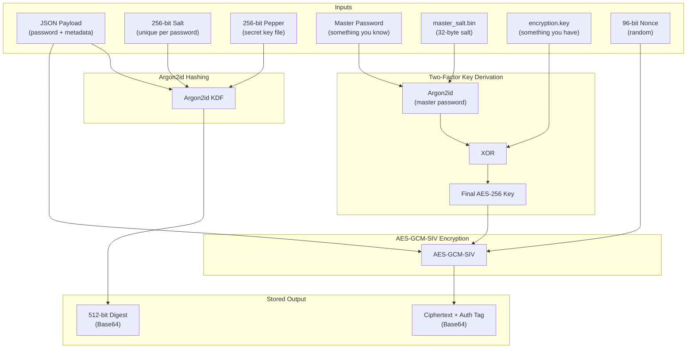

# 🔐 Secure Password Generator

[](https://www.redhat.com/en/technologies/linux-platforms/enterprise-linux) <!-- https://www.redhat.com/en/about/brand/standards/color -->
[](https://fedoraproject.org/) <!-- https://docs.fedoraproject.org/en-US/project/brand/#_colors -->
 <!-- https://brandpalettes.com/python-logo-colors -->
 <!-- https://brand.mit.edu/color -->


A robust, powerful, and secure command-line utility for generating **cryptographically strong passwords**. Built with Python's `secrets` module, this tool supports Argon2id password hashing and Base64-encoded AES-GCM-SIV encryption with customizable character sets, password metadata organization, and advanced search capabilities.

<br/>

<p align="center">

</p>

---

## ✨ Features

- **Cryptographically Secure** randomness via Python's `secrets` module
- **Two-Factor Encryption** — master password (something you know) XOR'd with `encryption.key` (something you have)
- **AES-GCM-SIV Encryption** with Base64-encoded storage for misuse-resistant authenticated encryption
- **Argon2id Hashing** with unique 256-bit salt per password and a separate 256-bit pepper key
- **Secure File Deletion** — uses Linux `shred -vuxzn` when available, with overwrite+unlink fallback
- **Restrictive Permissions** — all files created with `0600` (owner read/write only); warns if permissions drift
- **Flexible Character Policies** — uppercase, lowercase, digits, symbols, blanks, custom symbol sets, exclude similar characters, prevent consecutive duplicates, minimum per-type requirements
- **Pattern-Based Generation** — define exact character type positions (`l`=lower, `u`=upper, `d`=digit, `s`=symbol, `b`=blank, `*`=any)
- **Password Strength Meter** — entropy-based scoring with progressive character-type diversity bonuses (5 types = +3, 4 = +2, 3 = +1), expected-uniqueness penalties, pattern detection (1–10 scale)
- **Metadata & Organization** — labels, categories, comma-separated tags, automatic timestamps
- **History Management** — table view (via `tabulate`), search by label/category/tags, filter by strength/category/date, authenticated entry deletion
- **Config File Support** — load defaults from YAML or JSON config files; CLI args always override
- **Clipboard Support** — copy passwords via `pyperclip` or `xclip` (RHEL/Fedora Linux) with configurable auto-clear (`CLIPBOARD_CLEAR_SECONDS`, default 60 s)
- **Master Password Security** — environment variable (`SPG_MASTER_PASSWORD`), password file (`--master-password-file`), and interactive prompt; complexity requirements enforced (12+ chars, 3 of 4 types)
- **Structured Logging** — `--verbose` / `--quiet` flags; warnings and errors via Python `logging`

---

## 🚀 Getting Started

### 🔍 Prerequisites

**Python dependencies** are installed automatically by `pip` (see `pyproject.toml`):

|    Package     | Purpose                              |
|:--------------:|--------------------------------------|
| `argcomplete`  | Shell tab-completion                 |
| `cryptography` | AES-GCM-SIV encryption, Argon2id KDF |
|  `pyperclip`   | Clipboard support                    |
|    `PyYAML`    | YAML config file support             |
|   `tabulate`   | Formatted history table output       |
|    `pytest`    | Test suite (dev dependency)          |

**System/RPM dependencies** are listed in `bindep.txt`:

|   Package   | Purpose            | Required? |
|:-----------:|--------------------|:---------:|
| `coreutils` | Provides `shred`   |    Yes    |
|   `xclip`   | Clipboard fallback | Optional  |

Install system dependencies on Fedora / RHEL:

```bash
dnf install coreutils xclip
```

### 🛠️ Installation

1. Clone this repository:

    ```bash
    git clone https://github.com/jayissi/Secure-Password-Generator.git
    cd Secure-Password-Generator
    ```

2. Install the package (editable mode recommended for development):

    ```bash
    pip install -e .
    ```

    This installs all Python dependencies and creates the `pwgen` command.

3. Verify installation:

    ```bash
    pwgen -h
    ```

> **Note:** If you previously had a `~/bin/pwgen` script, remove it to
> avoid shadowing the pip-installed entry point.

<br/>

That's it! You're ready to generate passwords.

---

## 📁 Project Structure

```text
Secure-Password-Generator/
├── pyproject.toml                    # PEP 621 metadata and entry points
├── requirements.txt                  # pip install -r compatibility
├── bindep.txt                        # System/RPM dependencies
├── config-sample.yaml                # Example YAML config
├── config-example.json               # Example JSON config
├── secure_password_generator/        # Main package
│   ├── __init__.py                   # Version, public API, __all__
│   ├── py.typed                      # PEP 561 type-checking marker
│   ├── __main__.py                   # python -m support
│   ├── constants.py                  # All constants and defaults
│   ├── config.py                     # CharsetConfig dataclass, config loader
│   ├── crypto.py                     # Encryption, key mgmt, Argon2id
│   ├── generator.py                  # Password generation, strength scoring
│   ├── history.py                    # Vault CRUD, table formatting
│   ├── clipboard.py                  # Clipboard operations
│   ├── utils.py                      # Secure deletion, file permissions, logging
│   └── cli.py                        # Argument parser, main()
└── tests/
    ├── conftest.py                   # Shared fixtures (vault_dir, run_cli)
    ├── test_config.py                # Config loader tests
    ├── test_crypto.py                # Crypto module tests
    ├── test_generator.py             # Generator module tests
    ├── test_strength_pytest.py       # Strength scoring pytest suite
    ├── test_history.py               # Vault CRUD tests
    ├── test_cli.py                   # CLI integration tests (in-process)
    └── test_entry_points.py          # Subprocess smoke tests
├── benchmarks/                       # Performance diagnostic tools
│   ├── benchmark_strength.py         # Scoring consistency
│   ├── benchmark_generation.py       # Generation throughput
│   └── benchmark_crypto.py           # Crypto operation timing
```

---

## 💻 Usage

Run the `pwgen` command with your desired options.  
If you run `pwgen` with no arguments or with `-h`, it displays the help menu.

```bash
pwgen -h
```

You can also invoke via the Python module:

```bash
python -m secure_password_generator -h
```

### ⚙️ Command-Line Arguments

#### Basic Options

|         Argument         | Short | Description                                   | Default |
|:------------------------:|:-----:|-----------------------------------------------|:-------:|
|        `--length`        | `-L`  | Password length (min: 8)                      |   12    |
|        `--count`         | `-c`  | Number of passwords to generate               |    1    |
|      `--passphrase`      | `-P`  | Custom passphrase (supersedes other options)  |  None   |
|        `--config`        | `-f`  | Load defaults from YAML/JSON config file      |  None   |
|      `--clipboard`       | `-X`  | Copy password to clipboard (auto-clears)      |  False  |
|        `--unlock`        | `-U`  | Explicitly unlock vault with master password  |  False  |
|   `--master-password`    |       | Master password for scripting/CI              |  None   |
| `--master-password-file` |       | Read master password from file (first line)   |  None   |
| `--set-master-password`  |       | Configure/change master password + re-encrypt |  False  |
|       `--verbose`        | `-v`  | Enable debug output                           |  False  |
|        `--quiet`         |       | Suppress warnings                             |  False  |
|         `--help`         | `-h`  | Show help message                             |   N/A   |
|       `--version`        | `-V`  | Show version and exit                         |   N/A   |

#### Character Type Options

|      Argument       | Short | Description                                | Default |
|:-------------------:|:-----:|--------------------------------------------|:-------:|
|      `--full`       | `-F`  | Use all character types + no-repeats       |  False  |
|      `--upper`      | `-u`  | Include uppercase letters                  |  False  |
|      `--lower`      | `-l`  | Include lowercase letters                  |  False  |
|     `--digits`      | `-d`  | Include digits                             |  False  |
|     `--symbols`     | `-s`  | Include symbols                            |  False  |
| `--allowed-symbols` | `-a`  | Custom allowed symbols (implies --symbols) |  None   |
|      `--blank`      | `-b`  | Include space (never first/last)           |  False  |
|     `--pattern`     | `-p`  | Pattern string (l/u/d/s/b/* codes)         |  None   |

#### Advanced Options

|      Argument       | Short | Description                    | Default |
|:-------------------:|:-----:|--------------------------------|:-------:|
|       `--min`       | `-m`  | Min chars per selected type    |    1    |
|   `--no-repeats`    | `-r`  | No consecutive duplicate chars |  False  |
| `--exclude-similar` | `-e`  | Exclude similar-looking chars  |  False  |

#### Password Organization Options

|   Argument   | Description                  | Default |
|:------------:|------------------------------|:-------:|
|  `--label`   | Label/name for this password | Unnamed |
| `--category` | Category for this password   | General |
|   `--tags`   | Comma-separated tags         |   []    |

#### History Search & Filter Options

|      Argument       | Description                                    |
|:-------------------:|------------------------------------------------|
|     `--search`      | Search history by label, category, or tags     |
| `--filter-strength` | Show only passwords with strength >= value     |
| `--filter-category` | Show only passwords in this category           |
|      `--since`      | Show passwords since date (YYYY-MM-DD)         |
|  `--delete-entry`   | Delete specific entry by index (authenticated) |
|      `--limit`      | Limit number of history entries to display     |

#### File Operations

|      Argument       | Short | Description                      | Default |
|:-------------------:|:-----:|----------------------------------|:-------:|
| `--no-save-history` | `-n`  | Don't save to password history   |  False  |
|  `--show-history`   | `-H`  | Show password generation history |  False  |
|     `--cleanup`     | `-C`  | Clean up password and key files  |  False  |

---

## 📝 Examples

**1. Generate a strong password with all character types**  
Organize with labels, categories, and tags.

```bash
pwgen -F -L 16 --label "Gmail Account" --category "Email" --tags "work,important"
```

```text
Generated Password 1: p@55W0rD Ex&mpl3
Strength: ████████░░ 8/10
[+] Passwords securely saved to /home/user/.secure_passwords/vault.enc
```

<br/>

**2. Advanced requirements**  
Create (5x) 20-character passwords with at least 3 of each type, no similar characters, no consecutive duplicates, and a custom symbol set.

```bash
pwgen -c 5 -L 20 -u -l -d -m 3 -e -r -a '!@*#^ $&%\"' -n
```

<br/>

**3. Pattern-based generation**  
Define exact character type positions: `l`=lower, `u`=upper, `d`=digit, `s`=symbol, `b`=blank, `*`=any.

```bash
pwgen --pattern 'lluuddss' --label "Pattern Test" --category "Testing"
pwgen --pattern '****lluu' -n
```

<br/>

**4. Custom passphrase**  
Store a user-provided passphrase with metadata.

```bash
pwgen -P "MySecurePass123!" --label "Custom Pass" --category "Personal" --tags "manual"
```

<br/>

**5. View password history**  
Display saved passwords in a formatted table.

```bash
pwgen -H
```

```text
┌─────┬───────────────┬──────────────────────┬────────────┬────────────┬──────────────────┐
│   # │ Label         │ Password             │ Strength   │ Category   │ Created          │
├─────┼───────────────┼──────────────────────┼────────────┼────────────┼──────────────────┤
│   1 │ Gmail Account │ C1l|T3qZ7KfTqp8      │ 8/10       │ Email      │ 2025-11-15 08:56 │
│   2 │ Bank Account  │ 16DB<dNrUb9{         │ 6/10       │ Banking    │ 2025-11-15 08:55 │
└─────┴───────────────┴──────────────────────┴────────────┴────────────┴──────────────────┘
```

<br/>

**6. Search and filter history**  
Search, filter by category/strength, and combine filters.

```bash
pwgen -H --search "Gmail"
pwgen -H --filter-category "Email" --filter-strength 7 --limit 5
pwgen --delete-entry 1
```

<br/>

**7. Config file usage**  
Load defaults from a YAML or JSON config file. CLI arguments always override config values.

```bash
pwgen -f config.yaml
pwgen -f config.json -L 32
```

<br/>

**8. Secure cleanup**  
Securely delete all password and key files (including master salt).

```bash
pwgen -C
```

<br/>

**9. Two-factor encryption (master password)**  
Configure a master password so the vault requires both something you know and the on-disk `encryption.key`.

```bash
# First-time setup (interactive prompts)
pwgen --set-master-password

# Unlock is automatic when master_salt.bin exists; -U is optional
pwgen -U -H

# Environment variable (less secure — visible in /proc)
export SPG_MASTER_PASSWORD='YourSecret'
pwgen -H

# Password file (recommended for CI/automation)
echo 'YourSecret' > /tmp/mp.txt && chmod 600 /tmp/mp.txt
pwgen --master-password-file /tmp/mp.txt -H

# Direct CLI flag (least secure — visible in process lists)
pwgen --master-password 'YourSecret' -H
```

> **Master password requirements:** minimum 12 characters, at least
> 3 of 4 character types (uppercase, lowercase, digit, special).

---

## 📁 Config File

Load default settings from a YAML or JSON config file using `-f`. All fields are optional — omitted fields fall back to CLI defaults. Format is auto-detected by file extension (`.yaml`/`.yml`/`.json`).

**Example `config.yaml`:**

```yaml
length: 24
upper: true
lower: true
digits: true
symbols: true
no_repeats: true
exclude_similar: false
min_chars: 2
allowed_symbols: "!@#$%^&*?`"
blank_space: false
save_history: true

# Optional metadata defaults
label: "My Default Label"
category: "General"
tags: "default,work"
```

**Equivalent `config.json`:**

```json
{
  "length": 24,
  "upper": true,
  "lower": true,
  "digits": true,
  "symbols": true,
  "no_repeats": true,
  "exclude_similar": false,
  "min_chars": 2,
  "allowed_symbols": "!@#$%^&*?`",
  "blank_space": false,
  "save_history": true,
  "label": "My Default Label",
  "category": "General",
  "tags": "default,work"
}
```

**Config Field Reference:**

|       Field       |  Type  | Description                          |   Default   |
|:-----------------:|:------:|--------------------------------------|:-----------:|
|     `length`      |  int   | Password length (minimum: 8)         |     12      |
|      `upper`      |  bool  | Include uppercase letters            |    false    |
|      `lower`      |  bool  | Include lowercase letters            |    false    |
|     `digits`      |  bool  | Include digits                       |    false    |
|     `symbols`     |  bool  | Include symbols                      |    false    |
|   `no_repeats`    |  bool  | Prevent consecutive duplicates       |    false    |
| `exclude_similar` |  bool  | Exclude similar-looking characters   |    false    |
|    `min_chars`    |  int   | Minimum characters per selected type |      1      |
| `allowed_symbols` | string | Custom symbol set                    | All symbols |
|   `blank_space`   |  bool  | Include space character              |    false    |
|  `save_history`   |  bool  | Save password to encrypted history   |    true     |
|      `label`      | string | Default label for passwords          |  "Unnamed"  |
|    `category`     | string | Default category for passwords       |  "General"  |
|      `tags`       | string | Comma-separated default tags         |    None     |

> **Note:** Clipboard auto-clear timeout is controlled by the code-level constant `CLIPBOARD_CLEAR_SECONDS` (default `60`) in `constants.py`, not by the config file. Master password setup is CLI-only (`--set-master-password`).

---

## 🛡️ Security Details

This tool is designed with security as a top priority. `JSON Payload → Argon2id (Salt + Pepper) → Encrypt → Store`

### Storage Location

- **Password Vault**: `${HOME}/.secure_passwords/vault.enc`
- **Encryption Key**: `${HOME}/.secure_passwords/encryption.key` (256-bit key material)
- **Pepper Key**: `${HOME}/.secure_passwords/pepper.key` (256-bit pepper for Argon2id)
- **Master Salt**: `${HOME}/.secure_passwords/master_salt.bin` (32-byte salt for master-password KDF; created by `--set-master-password`)

### Security Features

- **Two-Factor Encryption**: When a master password is configured, the final AES-256 key is `Argon2id(master_password, master_salt) XOR encryption.key`. Stealing the vault directory alone is not enough.
- **Master Password Complexity**: Enforced minimum 12 characters with at least 3 of 4 character types (uppercase, lowercase, digit, special character).
- **Master Password Input**: Supports interactive prompt (default), environment variable (`SPG_MASTER_PASSWORD`), password file (`--master-password-file`), and direct CLI flag. Each method documents its security trade-offs.
- **Authenticated Deletion**: Entry deletion (`--delete-entry`) requires the encryption key, preventing unauthenticated vault modification.
- **Randomness**: Uses Python's `secrets` module, not `random`, ensuring cryptographic quality randomness.
- **Minimum Length**: Enforces a minimum of 8 characters, with recommended defaults of 12+.
- **AES-GCM-SIV Encryption**: Provides misuse-resistant authenticated encryption; records are Base64-encoded per line to prevent newline corruption.
- **Argon2id (Salt + Pepper) Hashing**:
  - Each password uses a **unique 256-bit salt** per password
  - A **separate 256-bit pepper** key file provides additional protection
  - 512-bit digest output
  - Memory-hard algorithm resistant to GPU/ASIC attacks
- **Timestamp**: Each password entry is stamped with creation time.
- **File Permissions**: All files are created with `0600` file permissions (read/write) restricted to the file's owner. The tool warns if permissions drift.
- **Secure Deletion**: Prefers Linux `shred -vuxzn` (overwrite, exact size, zero final pass, then unlink). Falls back to manual overwrite+unlink when `shred` is unavailable. Note: shred cannot guarantee erasure on SSDs, CoW filesystems (btrfs/ZFS), or data-journaled filesystems.
- **Clipboard Auto-Clear**: Copied passwords are scheduled to clear after `CLIPBOARD_CLEAR_SECONDS` (default 60).

### 🔐 Argon2id (Salt + Pepper) + Two-Factor AES-GCM-SIV Encryption Flow


```mermaid
flowchart TD
    subgraph inputs [Inputs]
        payload["JSON Payload<br/>(password + metadata)"]
        salt["256-bit Salt<br/>(unique per password)"]
        pepper["256-bit Pepper<br/>(secret key file)"]
        masterPw["Master Password<br/>(something you know)"]
        masterSalt["master_salt.bin<br/>(32-byte salt)"]
        fileKey["encryption.key<br/>(something you have)"]
        nonce["96-bit Nonce<br/>(random)"]
    end

    subgraph hashing [Argon2id Hashing]
        argon2["Argon2id KDF"]
    end

    subgraph keyDerivation [Two-Factor Key Derivation]
        masterKdf["Argon2id<br/>(master password)"]
        xorOp["XOR"]
        finalKey["Final AES-256 Key"]
    end

    subgraph encryption [AES-GCM-SIV Encryption]
        aesgcm["AES-GCM-SIV"]
    end

    subgraph output [Stored Output]
        digest["512-bit Digest<br/>(Base64)"]
        ciphertext["Ciphertext + Auth Tag<br/>(Base64)"]
    end

    payload --> argon2
    salt --> argon2
    pepper --> argon2
    argon2 --> digest

    masterPw --> masterKdf
    masterSalt --> masterKdf
    masterKdf --> xorOp
    fileKey --> xorOp
    xorOp --> finalKey

    payload --> aesgcm
    finalKey --> aesgcm
    nonce --> aesgcm
    aesgcm --> ciphertext
```

<br/>

> [!CAUTION]
> You are responsible for the secure management of the `${HOME}/.secure_passwords/` directory **and** your master password.  
> Keep the master password secret (never share it). Do not store `encryption.key` / `master_salt.bin` insecurely, and ***do not share or back them up insecurely***. Losing either factor may make the vault unrecoverable.

---

## 🧪 Testing

The entire test suite (126 tests) runs through pytest in under 2 seconds.  A test-mode Argon2id profile is applied automatically by `conftest.py`.

### Running Tests

```bash
pytest tests/ -v
```

Or test in an isolated Podman container:

```bash
podman run --rm -v $(pwd):/workspace:Z fedora:latest bash -c \
  "cd /workspace && dnf install -y python3 python3-pip > /dev/null 2>&1 \
  && pip3 install -e '.[dev]' > /dev/null 2>&1 \
  && pytest tests/ -v"
```

### Test Files

|           File            | Tests | Coverage                                                    |
|:-------------------------:|:-----:|-------------------------------------------------------------|
|     `test_config.py`      |  14   | Config loading, `CharsetConfig`, `ConfigError`              |
|     `test_crypto.py`      |  16   | Encrypt/decrypt, key management, master-password validation |
|    `test_generator.py`    |  19   | Charset, generation constraints, progressive scoring        |
| `test_strength_pytest.py` |  37   | Entropy boundaries, consistency, edge cases                 |
|     `test_history.py`     |  18   | Vault CRUD, search/filter, authenticated delete             |
|       `test_cli.py`       |  19   | CLI integration (in-process via `run_cli()`)                |
|  `test_entry_points.py`   |   3   | Subprocess smoke tests (`pwgen`, `python -m`)               |

### Benchmarks

Performance diagnostic tools live in `benchmarks/` (not collected by pytest):

```bash
python benchmarks/benchmark_strength.py -n 200    # scoring consistency
python benchmarks/benchmark_generation.py -n 500   # generation throughput
python benchmarks/benchmark_crypto.py -n 10         # crypto timing (production KDF)
```

---

## 🤝 Contributing

Contributions are welcome! Please open an issue or pull request for any improvements.

---

## 📜 License

This project is licensed under the MIT License. See the [LICENSE](LICENSE) file for more details.
