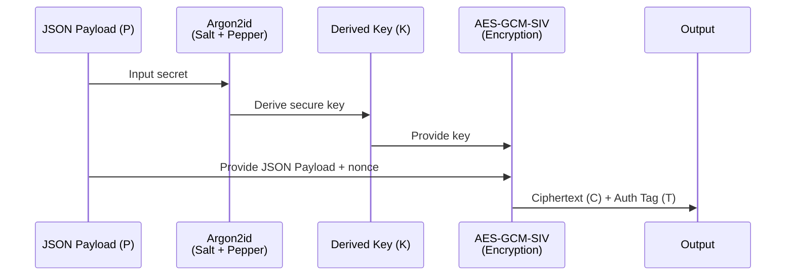

# 🔐 Secure Password Generator


A robust, powerful, and secure command-line utility for generating **cryptographically strong passwords**. Built with Python’s `secrets` module, this tool supports Argon2id password hashing and Base64-encoded AES-GCM-SIV encryption with customizable character sets and minimum character requirements.

<br/>

<p align="center">

</p>

---

## ✨ Features

- **Cryptographically Secure**:
  Utilizes Python's `secrets` module, which is designed to generate unpredictable random values suitable for cryptographic purposes.

- **Flexible Password Policies**:
  - Minimum enforced length (8+ characters, configurable)
  - Uppercase letters (`A-Z`)
  - Lowercase letters (`a-z`)
  - Digits (`0-9`)
  - Symbols (customizable or default punctuation)
  - Minimum character requirements per character type
  - Prevent consecutive duplicate characters
  - Exclude similar-looking characters (`i`, `l`, `1`, `L`, `o`, `0`, `O`)

- **Advanced options**:
  - Generate multiple passwords at once
  - View previously generated passwords

- **Argon2id Salt+Pepper & Timestamp**  
  Each password is accompanied by:  
  - A **unique Argon2id Salt+Pepper** (16 bytes, Base64-encoded)  
  - A **derived Argon2id hash** (512-bit digest, Base64-encoded)  
  - A **timestamp** recording when it was created

- **Secure Encryption & Storage**  
  - Password records (including Salt + Pepper + hash + timestamp) are serialized as JSON  
  - Encrypted with **AES-GCM-SIV**, which provides nonce misuse resistance  
  - Encoded safely in **Base64**, one entry per line, to prevent file corruption  
  - Stored at `${HOME}/.password_list.enc` with owner-only permissions (`0600`)

- **User-Friendly CLI**:
  Clean interface powered by `argparse` with grouped options and helpful usage examples

- **Zero Dependencies**:
  Pure Python script. No external libraries are needed—just a standard Python 3 installation.

---

## 🚀 Getting Started

### 🔍 Prerequisites

- Python **3.13+**
- No external dependencies required beyond `cryptography`

### 🛠️ Installation

1. Clone this repository to your local machine:

    ```bash
    git clone https://github.com/jayissi/Secure-Password-Generator.git
    ```

2. Install python3-cryptography on your local machine:

    ```bash
    pip3 install -r requirements.txt
    ```

3. Make the script executable:

    ```bash
    chmod +x Secure-Password-Generator/password_generator.py
    ```

4. Move it to your local bin folder (on Linux/macOS):

    ```bash
    sudo mv Secure-Password-Generator/password_generator.py /usr/local/bin/password_generator
    ```

<br/>

That's it! You're ready to generate passwords.

---

## 💻 Usage

Run the script from your terminal using `password_generator` with your desired options.  
If you run the script with no arguments or with the `-h` flag, it will display the help menu.

```bash
password_generator -h
```

### ⚙️ Command-Line Arguments

| Argument               | Short | Description                                  | Default |
|:----------------------:|:-----:|----------------------------------------------|:-------:|
| `--length`             | `-L`  | Password length (min: 8)                     | 12      |
| `--upper`              | `-u`  | Include uppercase letters                    | False   |
| `--lower`              | `-l`  | Include lowercase letters                    | False   |
| `--digits`             | `-d`  | Include digits                               | False   |
| `--symbols`            | `-s`  | Include symbols                              | False   |
| `--allowed-symbols`    | `-a`  | Custom allowed symbols (implies `--symbols`) | None    |
| `--min`                | `-m`  | Min chars per selected type                  | 1       |
| `--count`              | `-c`  | Number of passwords to generate              | 1       |
| `--exclude-similar`    | `-e`  | Exclude similar-looking chars                | False   |
| `--no-repeats`         | `-r`  | No consecutive duplicate chars               | False   |
| `--no-save`            | `-n`  | Don't save to password file                  | False   |
| `--show-history`       | `-H`  | Show password history                        | False   |
| `--cleanup`            | `-C`  | Clean up password and key files              | False   |
| `--help`               | `-h`  | Show help message                            | N/A     |

## 📝 Examples

**1. Generate and save a password (16 chars, all types)**
Create a 16-character password using all character types and save it to `${HOME}/.password_list.enc`.

```bash
password_generator -L 16 -u -l -d -s
```

**Output:**

```bash
Generated Password 1: p@55W0rD_Ex&mpl3
[✓] Passwords securely saved to ${HOME}/.password_list.enc
```

<br/>

**2. Generate a 26-character password (no repeats, do not save)**
This creates a 26-character password with no repetitive characters.

```bash
password_generator -L 26 --upper --lower --digits --symbols --no-repeats --no-save
```

**Output:**

```bash
Generated Password 1: V3ry-L0ng&S3cur3!P@ssw0rd#
```

<br/>

**3. Generate a password with strict requirements**
Create a 16-character password with at least 2 of each selected character type.

```bash
password_generator -L 16 --upper --lower --digits --symbols --no-repeats --min 2 --no-save
```

<br/>

**4. Use a custom symbol set**
Create a password using only `@#$%` as symbols

```bash
password_generator -n -u -l -a '@#$%'
```

<br/>

**5. Advanced Requirements**
Create (5x) 20-character password with:

- At least 3 of each character type
- No similar characters
- No consecutive duplicates
- Only use `!@*#^ $&%\"` as valid symbols
- Output to stdout only

```bash
password_generator -c 5 -L 20 -u -l -d -m 3 -e -r -a '!@*#^ $&%\"' -n
```

---

## 🛡️ Security Details

This tool is designed with security as a top priority. `JSON Payload → Argon2id(salt+pepper) → Encrypt → Store`

- **Randomness**: Uses Python’s `secrets` module, not `random`, ensuring cryptographic quality randomness.

- **Minimum Length**: Enforces a minimum of 8 characters, with recommended defaults of 12+.

- **AES-GCM-SIV Encryption**: Provides misuse-resistant authenticated encryption; records are Base64-encoded per line to prevent newline corruption.

- **Argon2id Hashing**: Each password is hashed with Argon2id using a unique 16-byte Salt+Pepper. The AES key file also serves as a pepper, further protecting against offline brute force attacks.

- **Timestamp**: Each password entry is stamped with creation time.

- **File Permissions**: The password history file is created with `0600` file permissions (read/write) restricted to the file’s owner.

<br/>

### 🧂 Salt vs 🌶️ Pepper

When protecting passwords, two important concepts are often combined: **salt** and **pepper**. Both strengthen security, but they serve very different purposes.

#### 🧂 Salt

- A **salt** is a unique, random value generated for each password.  
- It ensures that even if two users choose the same password, their hashes will be different.  
- Salts protect against **rainbow table** and precomputed dictionary attacks.  
- **Not secret** — salts are usually stored alongside the password hash in the database.

#### 🌶️ Pepper

- A **pepper** is an additional **secret value** (like a hidden key) used during hashing.  
- Unlike salts, peppers are **not stored with the hashes**. Instead, they’re kept in a secure location such as:
  - A configuration file with restricted access
  - An environment variable
  - A Hardware Security Module (HSM)
- If an attacker steals the database, they cannot brute-force hashes without also knowing the pepper.

#### 🔐 Why Both?

- **Salt** defends against precomputation attacks and ensures uniqueness.  
- **Pepper** adds an extra layer of defense — even if the database is leaked, the attacker still needs the hidden pepper to verify guesses.  
- Together, salt and pepper provide **defense in depth**, making password cracking far more difficult.

**Key Differences:**  

- Salt = *public, unique, stored with the hash* (e.g. *public spice* per password.)
- Pepper = *private, shared, stored separately* (e.g. *secret ingredient* known only to the chef.)

<br/>

Here is a simple flow chart:

## 🔐 Argon2id + AES-GCM-SIV Encryption Flow



### 📝 Explanation

1. **JSON Payload (P)** is the input secret (e.g., a password).  
2. **Argon2id** takes the JSON Payload, adds a **random salt** and a secret **pepper**, and produces a strong, memory-hard **derived key**.  
3. The **derived key (K)** `Key + Nonce + JSON Payload` is fed into **AES-GCM-SIV** as the encryption key.  
4. AES-GCM-SIV produces both **Ciphertext (C)** and an **Authentication Tag (T)** for integrity.  
5. The final secure output is stored as `{ salt, nonce, ciphertext, tag }` where only the **pepper** remains secret.

<br/>

> [!CAUTION]
> You are responsible for the secure management of the `${HOME}/.password_list.enc` file and the `${HOME}/.password_key.aes256` key file.  
> Ensure it is stored and secured properly and ***do not share or back them up insecurely***.

---

## 🤝 Contributing

Contributions are welcome! Please open an issue or pull request for any improvements.

---

## 📜 License

This project is licensed under the MIT License. See the [LICENSE](https://github.com/jayissi/Secure-Password-Generator/blob/main/LICENSE) file for more details.
