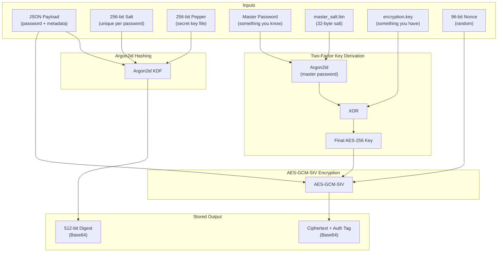

# 🛡️ Security Details

> Back to [main README](../README.md)

This tool is designed with security as a top priority.

`JSON Payload → Argon2id (Salt + Pepper) → Encrypt → Store`

---

## Storage Location

| File               | Path                                          | Purpose                              |
|:-------------------|:----------------------------------------------|:-------------------------------------|
| Password Vault     | `~/.secure_passwords/vault.enc`               | Encrypted password records           |
| Encryption Key     | `~/.secure_passwords/encryption.key`          | 256-bit AES key material             |
| Pepper Key         | `~/.secure_passwords/pepper.key`              | 256-bit pepper for Argon2id          |
| Master Salt        | `~/.secure_passwords/master_salt.bin`         | 32-byte salt for master-password KDF |

---

## Security Features

- **Two-Factor Encryption**: When a master password is configured, the final AES-256 key is `Argon2id(master_password, master_salt) XOR encryption.key`. Stealing the vault directory alone is not enough.
- **Master Password Complexity**: Enforced minimum 12 characters with at least 3 of 4 character types (uppercase, lowercase, digit, special character).
- **Master Password Input**: Supports interactive prompt (default), environment variable (`SPG_MASTER_PASSWORD`), password file (`--master-password-file`), and direct CLI flag. Each method documents its security trade-offs.
- **Authenticated Deletion**: Entry deletion (`--delete-entry`) requires the encryption key, preventing unauthenticated vault modification.
- **Randomness**: Uses Python's `secrets` module, not `random`, ensuring cryptographic quality randomness.
- **Minimum Length**: Enforces a minimum of 8 characters, with recommended defaults of 12+.
- **AES-GCM-SIV Encryption**: Provides misuse-resistant authenticated encryption; records are Base64-encoded per line to prevent newline corruption.
- **Argon2id (Salt + Pepper) Hashing**:
  - Each password uses a **unique 256-bit salt** per password
  - A **separate 256-bit pepper** key file provides additional protection
  - 512-bit digest output
  - Memory-hard algorithm resistant to GPU/ASIC attacks
- **Timestamp**: Each password entry is stamped with creation time.
- **File Permissions**: All files are created with `0600` file permissions (read/write) restricted to the file's owner. The tool warns if permissions drift.
- **Secure Deletion**: Prefers Linux `shred -vuxzn` (overwrite, exact size, zero final pass, then unlink). Falls back to manual overwrite+unlink when `shred` is unavailable. Note: shred cannot guarantee erasure on SSDs, CoW filesystems (btrfs/ZFS), or data-journaled filesystems.
- **Clipboard Auto-Clear**: Copied passwords are scheduled to clear after `CLIPBOARD_CLEAR_SECONDS` (default 60).

---

## Argon2id (Salt + Pepper) + Two-Factor AES-GCM-SIV Encryption Flow

---

> [!CAUTION]
> You are responsible for the secure management of the `~/.secure_passwords/` directory **and** your master password.
> Keep the master password secret (never share it). Do not store `encryption.key` / `master_salt.bin` insecurely, and ***do not share or back them up insecurely***. Losing either factor may make the vault unrecoverable.
