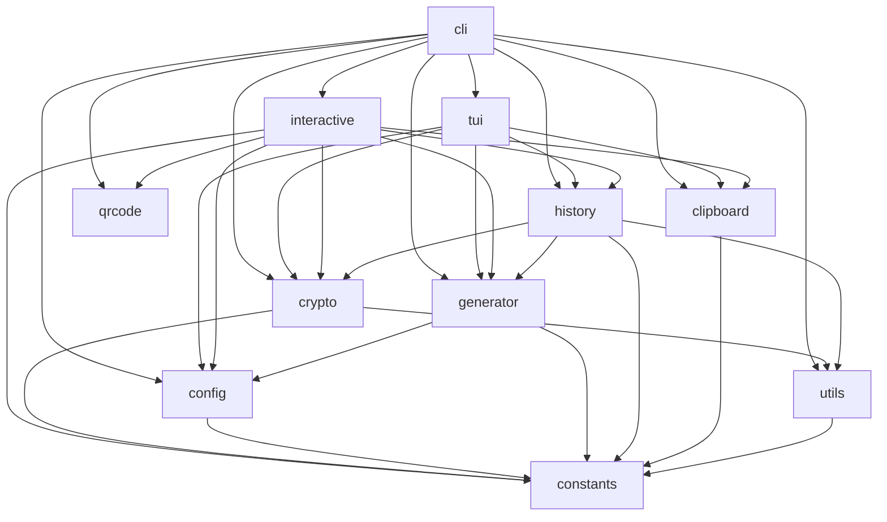

# secure\_password\_generator -- Package Reference

> Back to [main README](../README.md)

This directory contains the core Python package for the Secure Password
Generator.  After installation (`python -m pip install -e .`), the package provides
the `pwgen` command-line tool and can also be invoked as
`python -m secure_password_generator`.

---

## Architecture

The diagram below shows the import relationships between modules.
Arrows point from the importing module to its dependency.

**Key observations:**

- `constants.py` is a leaf dependency -- every other module reads from it,
  and it imports nothing from the package.
- `cli.py` is the top-level orchestrator -- it ties all other modules
  together but no module imports from `cli`.
- `interactive.py` is a parallel entry point to `cli.py`, reusing the
  same generation, crypto, and history modules via a `cmd.Cmd` REPL.
- `crypto.py` and `generator.py` are the two heaviest modules.  They are
  independent of each other; `history.py` bridges them.

---

## Module Reference

### `__init__.py`

**Purpose:** Package root.  Declares the version string, re-exports the
public API, and defines `__all__` so that `from secure_password_generator
import *` exposes only the intended symbols.  A `py.typed` marker file
(PEP 561) is included alongside this module to enable downstream
type-checking support.

**Key exports:**

- `__version__` -- semantic version string (currently `"2.0.0"`)
- Re-exports from `config`: `CharsetConfig`, `ConfigError`
- Re-exports from `crypto`: `encrypt_data`, `decrypt_data`,
  `get_encryption_key`
- Re-exports from `generator`: `build_charset`,
  `calculate_password_strength`, `compute_charset_size`,
  `expected_unique_chars`, `format_strength_inline`,
  `format_strength_meter`, `generate_password`

**Dependencies:** `config`, `crypto`, `generator`

**Dependents:** external consumers importing the package directly

---

### `__main__.py`

**Purpose:** Allows the package to be executed with
`python -m secure_password_generator`.  Contains only a bootstrap call to
`cli.main()`.

**Key exports:** none (script entry point only)

**Dependencies:** `cli`

**Dependents:** none (invoked by the Python runtime)

---

### `constants.py`

**Purpose:** Single source of truth for every tunable value, file path,
ANSI colour code, and cryptographic parameter in the project.  Centralising
these values here ensures that changes propagate automatically and that no
module hard-codes magic numbers.

**Key exports:**

- Password generation: `MIN_PASSWORD_LENGTH` (8), `DEFAULT_PASSWORD_LENGTH`
  (12), `MAX_GENERATION_ATTEMPTS` (100)
- Security: `SECURE_DELETE_PASSES` (3), `CLIPBOARD_CLEAR_SECONDS` (60),
  `MIN_ENCRYPTED_LENGTH` (28), `DEFAULT_FILE_PERMISSIONS` (0o600),
  `DEFAULT_DIR_PERMISSIONS` (0o700), `SIMILAR_CHARS`
- Latin-1 Supplement: `LATIN_EXT_CHARS` (93 printable characters from
  U+00A1 to U+00FF, excluding U+00AD)
- Argon2id parameters: `ARGON2_DIGEST_LENGTH` (64), `MASTER_KDF_LENGTH`
  (32), `ARGON2_ITERATIONS` (100), `ARGON2_LANES` (4),
  `ARGON2_MEMORY_COST` (64 MiB)
- Master-password complexity: `MASTER_PASSWORD_MIN_LENGTH` (12),
  `MASTER_PASSWORD_MIN_TYPES` (3 of 4)
- File paths: `PASSWORD_DIR`, `PASSWORD_FILE`, `KEY_FILE`, `PEPPER_FILE`,
  `MASTER_SALT_FILE` -- all under `~/.secure_passwords/`
- ANSI colours: `COLOR_RED`, `COLOR_ORANGE`, `COLOR_YELLOW`,
  `COLOR_GREEN`, `COLOR_BRIGHT_GREEN`, `COLOR_RESET`
- Config-file support: `VALID_CONFIG_KEYS`, `CONFIG_KEY_MAP`
- Environment variables: `ENV_MASTER_PASSWORD` (`SPG_MASTER_PASSWORD`)

**Dependencies:** none (standard library `pathlib` only)

**Dependents:** every other module in the package

---

### `config.py`

**Purpose:** Owns the `CharsetConfig` frozen dataclass that specifies
which character types to include when generating a password, and the
`load_config()` function that reads YAML/JSON configuration files.  Also
defines `ConfigError`, the exception raised for all config-file problems.

**Key exports:**

- `CharsetConfig` -- immutable (frozen) dataclass with fields:
  `use_upper`, `use_lower`, `use_digits`, `use_symbols`,
  `allowed_symbols`, `exclude_similar`, `blank`, `latin_ext`.  Used by
  `generator.py` and constructed by `cli.py` from parsed arguments.
- `ConfigError` -- exception class raised when a config file is missing,
  has invalid syntax, uses an unsupported extension, or contains unknown
  keys.  Caught by `cli.main()` which prints the message and exits.
- `load_config(config_path)` -- reads a `.yaml`, `.yml`, or `.json` file,
  validates all keys against `VALID_CONFIG_KEYS`, maps `blank_space` to
  `blank` via `CONFIG_KEY_MAP`, and returns a plain dictionary.

**Dependencies:** `constants`

**Dependents:** `generator`, `cli`, `__init__`

---

### `utils.py`

**Purpose:** Low-level utility functions shared across the package:
structured logging setup, file-permission verification, and secure file
deletion.

**Key exports:**

- `configure_logging(*, verbose, quiet)` -- configures the package-level
  logger (`"secure_password_generator"`).  Called once at CLI startup.
  `--verbose` sets DEBUG, `--quiet` sets ERROR, default is WARNING.
- `verify_file_permissions(file_path)` -- checks that a security-sensitive
  file has mode `0600` and emits a warning via the logger if it does not.
- `secure_delete_file(file_path, passes)` -- securely deletes a file.
  Prefers the Linux `shred` binary (`shred -vuxzn`); falls back to manual
  multi-pass overwrite with `secrets.token_bytes` + `os.fsync` + `unlink`
  when `shred` is not available.

**Dependencies:** `constants`

**Dependents:** `crypto`, `history`

---

### `crypto.py`

**Purpose:** All cryptographic operations: AES-GCM-SIV encryption and
decryption, Argon2id password hashing (with salt + pepper), encryption-key
management and caching, two-factor key derivation (master password XOR
file key), master-password lifecycle (set, change, validate, resolve),
and vault cleanup.

This is the security core of the application.

**Key exports:**

- `initialize_security_files()` -- creates `~/.secure_passwords/` and
  generates `encryption.key` and `pepper.key` if they do not exist.
- `encrypt_data(data, key)` / `decrypt_data(encrypted, key)` --
  AES-256-GCM-SIV authenticated encryption.  The 12-byte nonce is
  prepended to the ciphertext.
- `argon2id_hash(password)` -- derives a 512-bit Argon2id digest using a
  unique 256-bit salt and the on-disk pepper.  Returns a dict with
  Base64-encoded salt, digest, and KDF parameters.
- `get_encryption_key(master_password)` -- resolves the final AES-256 key.
  When a master password is configured, the result is
  `Argon2id(master_password) XOR encryption.key` (two-factor).  Otherwise
  the raw file key is returned.  The derived key is cached per-process
  using a random session token (no fast hash of the password is stored).
- `resolve_master_password(args)` -- resolves the master password using a
  five-level priority chain: (1) `--master-password` CLI flag,
  (2) `SPG_MASTER_PASSWORD` environment variable, (3)
  `--master-password-file`, (4) interactive `getpass` prompt, (5) `None`.
- `set_master_password(new_password, current_password)` -- configures or
  rotates the master password.  Decrypts the vault with the old key,
  validates the new password against complexity requirements, generates a
  fresh 256-bit salt, derives the new combined key, and re-encrypts every
  vault entry.
- `_validate_master_password(password)` -- enforces minimum 12 characters
  and at least 3 of 4 character types (upper, lower, digit, special).
- `cleanup_files()` -- securely deletes all vault and key files.

**Dependencies:** `constants`, `utils`

**Dependents:** `history`, `cli`, `__init__`

---

### `generator.py`

**Purpose:** Password generation engine and strength scoring.  Builds the
character pool from a `CharsetConfig`, generates passwords with
configurable constraints (minimum per-type, no consecutive repeats, blank
never at edges), supports pattern-based generation, and scores passwords
on a 1--10 scale using entropy, diversity, uniqueness, and pattern
detection.

**Key exports:**

- `build_charset(cfg)` -- takes a `CharsetConfig` and returns a list of
  `(name, characters)` tuples representing the active character pool.
  Similar-looking characters are filtered via `_filter_similar_chars`
  (LRU-cached).
- `compute_charset_size(cfg)` -- returns the total number of distinct
  characters in the pool (minimum 1).
- `expected_unique_chars(pool_size, length)` -- birthday-problem formula
  for the expected number of distinct characters in a random draw.
- `calculate_password_strength(password, charset_size)` -- entropy-based
  scoring with progressive character-type diversity bonuses (6 types = +4,
  5 = +3, 4 = +2, 3 = +1, 2 = +0, 1 = -1), expected-uniqueness penalties,
  consecutive-repeat penalty, and simple-pattern penalty.  Returns an
  integer from 1 to 10.
- `format_strength_meter(score)` -- renders a coloured Unicode bar such as
  `████████░░ 8/10`.  Used in the strength summary footer.
- `format_strength_inline(score)` -- renders a compact coloured tag such
  as `[8/10]`.  Used inline next to each generated password.
- `generate_password(length, cfg, ...)` -- main generation function.
  Reserves positions for each character type to satisfy minimums, fills
  remaining slots from the full pool, then verifies all constraints.
  Retries up to `MAX_GENERATION_ATTEMPTS` times.  Supports pattern-based
  generation when the `pattern` argument is provided, with automatic
  padding to `MIN_PASSWORD_LENGTH`.
- `generate_password_from_pattern(pattern, allowed_symbols)` -- generates
  a password from a pattern string (`l`=lower, `u`=upper, `d`=digit,
  `s`=symbol, `b`=blank, `*`=any).
- `generate_symbol_only_password(length, symbols)` -- special-case
  generator for symbol-only passwords with no consecutive repeats.

**Dependencies:** `config`, `constants`

**Dependents:** `history`, `cli`, `__init__`

---

### `history.py`

**Purpose:** Vault CRUD operations, formatted table output, and
search/filter.  Each password record is a JSON object containing the
password, strength score, Argon2id hash, label, category, tags, and
timestamp.  Records are encrypted individually and stored as
Base64-encoded lines in `vault.enc`.

**Key exports:**

- `format_history_table(entries)` -- formats a list of decrypted records
  as a Unicode table using the `tabulate` library (format `simple_grid`).
  Strength scores are coloured using ANSI codes (green/yellow/orange/red).
- `save_password(password, key, ...)` -- encrypts and appends a new record
  to the vault file with metadata (label, category, tags, timestamp,
  strength score, Argon2id hash).
- `show_password_history(key, ...)` -- decrypts and displays vault entries
  with optional filters: `search` (label/category/tags substring match),
  `filter_strength` (minimum score), `filter_category` (exact match),
  `since` (date threshold), `limit` (max entries).
- `delete_entry_by_index(index, key, ...)` -- authenticated deletion.
  Decrypts the target entry to verify the key is correct, removes it by
  position (`.pop()`), securely deletes the old vault file, and writes the
  remaining entries to a new file.

**Dependencies:** `crypto`, `generator`, `utils`, `constants`

**Dependents:** `cli`

---

### `clipboard.py`

**Purpose:** System clipboard integration via `pyperclip`.  Provides
copy-to-clipboard and a configurable auto-clear timer.

**Key exports:**

- `copy_to_clipboard(password)` -- copies a string to the system
  clipboard via `pyperclip`.  Returns `True` on success, `False`
  otherwise.
- `schedule_clipboard_clear()` -- starts a daemon thread that overwrites
  the clipboard with an empty string after `CLIPBOARD_CLEAR_SECONDS`
  (default 60).

**Dependencies:** `constants`

**Dependents:** `cli`, `interactive`

---

### `qrcode.py`

**Purpose:** QR code generation for passwords via `segno`.  Provides
terminal display and PNG file save.

**Key exports:**

- `display_qr(text)` -- prints a QR code to the terminal using Unicode
  blocks (`segno.make().terminal(compact=True)`).
- `save_qr(text, path, scale)` -- saves a QR code as a PNG file with
  configurable scale (default 5).

**Dependencies:** `segno` (external)

**Dependents:** `cli`, `interactive`, `tui`

---

### `tui.py`

**Purpose:** Graphical terminal UI via Textual.  Provides a tabbed
application with Generate, History, and Health panes, master-password
modal, and keyboard navigation.  Launch with `pwgen -t`.

**Key exports:**

- `PwgenTUI` -- `textual.App` subclass with three tabbed panes and
  a master-password modal dialog.

**Dependencies:** `textual` (external), `config`, `crypto`, `generator`,
`history`, `clipboard`

**Dependents:** `cli` (lazy-imported when `--tui` is passed)

---

### `interactive.py`

**Purpose:** Interactive REPL for guided password generation.  Provides a
`cmd.Cmd` subclass (`PwgenShell`) with commands for quick generation,
custom wizards, vault browsing, and health reporting.

**Key exports:**

- `PwgenShell` -- `cmd.Cmd` subclass with `pwgen>` prompt and commands:
  `quick [LENGTH]` (generate with all types, default 24), `new` (guided
  wizard), `generate [flags]` (CLI-style with batch prompt), `browse`
  (paginated vault view), `health` (score distribution and vault stats),
  `history`, `delete`, `label`, `cleanup`, `clear`, `quit`/`exit`/EOF.
- Session-cached encryption key (`self._key`) -- prompted once on first
  vault operation and cleared on exit.

**Dependencies:** `config`, `crypto`, `generator`, `history`, `clipboard`,
`constants`

**Dependents:** `cli` (lazy-imported when `--interactive` is passed)

---

### `cli.py`

**Purpose:** Command-line interface.  Defines all `argparse` arguments
(grouped into Basic, Character Type, Advanced, Organization, Filter, and
File Operations), applies YAML/JSON config-file defaults, wires up master-
password workflows, and orchestrates password generation, display, history
management, clipboard copy, and cleanup.

This module is the sole entry point for end users.  The `pwgen` console
script (defined in `pyproject.toml`) and `__main__.py` both call
`cli.main()`.

**Key exports:**

- `create_argument_parser()` -- builds and returns the
  `argparse.ArgumentParser` with all argument groups (including
  `--version`/`-V`), a custom help formatter (inline usage examples),
  and `argcomplete` tab-completion for config files.
- `main()` -- top-level entry point.  Execution flow:
  1. Parse arguments and enable `argcomplete`.
  2. Configure logging (`--verbose` / `--quiet`).
  3. Apply config-file defaults if `-f` was given (CLI args override).
  4. Handle `--set-master-password` or `--cleanup` and exit.
  5. Handle `--show-history` or `--delete-entry` (both require the key).
  6. Resolve character-type flags (`--full` expands to all types;
     `--latin-ext` is opt-in only, not included in `--full`).
  7. Generate one or more passwords, display strength, optionally copy to
     clipboard, and optionally save to the encrypted vault.

**Dependencies:** `config`, `crypto`, `generator`, `history`, `clipboard`,
`utils`, `constants`

**Dependents:** `__main__`, `__init__` (indirectly via the entry point)

---

## How the Modules Work Together

A typical `pwgen -F -L 24 --label "Work"` invocation flows through the
package as follows:

1. `cli.main()` parses arguments and calls `configure_logging()` from
   `utils`.
2. `cli` builds a `CharsetConfig` from the parsed flags and passes it to
   `generator.compute_charset_size()` to compute the pool size.
3. `cli` calls `crypto.resolve_master_password()` and
   `crypto.get_encryption_key()` to obtain the vault key.
4. `cli` calls `generator.generate_password()`, which uses
   `generator.build_charset()` to construct the character pool and then
   fills slots with `secrets.choice()`.
5. `cli` calls `generator.calculate_password_strength()` and
   `generator.format_strength_inline()` to display the inline score, and
   prints a strength summary footer using `format_strength_meter()`.
6. `cli` calls `history.save_password()`, which calls
   `crypto.argon2id_hash()` to hash the password and
   `crypto.encrypt_data()` to encrypt the record before appending it to
   `vault.enc`.
7. If `--clipboard` was given, `cli` calls `clipboard.copy_to_clipboard()`
   and `clipboard.schedule_clipboard_clear()`.
